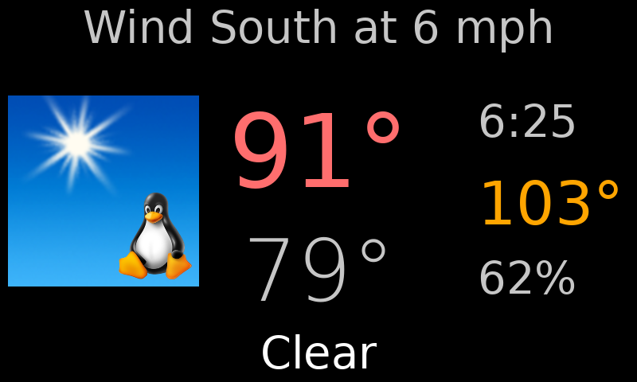

# WeatherBird
A weather station based on pygame-ce and a mix of local and NWS data

This README will be filled out more when the code is uploaded. Here are some basics

## Interaction ##
- Touch on the far left to go to the base display if it's not already shown. If the base display is shown, a far left touch toggles between the weather picture and the radar picture.
- Touch on the far right to jump immediately to the forecasts. Additional far right touches cycle through the forecast days.
- A touch in the middle of the screen to advance forward to the next display.
- A USB keyboard can be used; any key advances one display. Exit the program with "q". (I used a cordless keyboard with a 2.4 Ghz USB dongle.)

## Web interface ##
The current display, whichever it is, is available via HTTP on port 80 at the root URI. Clicking anywhere on the image advances through a series of displays that are somewhat different than shown on the device itself.



## Execution ##
- The ```wbird.sh``` script is started by the GUI after the user is automatically logged in after boot. That script runs ```wbird.py``` in a loop, ensuring that it automatically restarts if it crashes. There is a minimum time between restarts to avoid thrasing the data sources if it crashes immediately.
- The ```wbird.py``` process will stop and the ```wbird.sh``` script will pause if the file ```STOP``` exists in the working directory (```/home/pi/wbird```).

## Implementation ##
- **Configuration** is in ```wb_config.py```. This is a late addition to the code base, so it's not as well integrated into all the modules as it could/should be.
- **Display sources** are listed in the ```altUrls``` list in ```wb_config.py``` . The first entry is blank as it is the default internally-generated display. The others are actually laid over the base display. Those that are less than 480 pixels tall let the wind/warnings and current conditions show through from the base display at the top and bottom.
- **Location** is given as latitude and longitude in ```wb_config.py``` for warnings and watches, and with the ```myStationId``` setting which names the National Weather Service weather station for current conditions.
- **Temperature and Humidity**
  - Outside temperature is *not* pulled directly from the NWS by the main processes. A background service pulls that and writes it to ```/var/log/weather.log```.
  - Inside temperature typically comes from a separate little server on a Pi Zero W that can be placed somewhere in the house more representative of the ambient home temperature than where the WeatherBird display is located. The sensor that is used *could* be wired into the GPIO pins of the WeatherBird's Pi itself, but with the caveat that the larger, busier Pi and always-on screen generate some heat that could affect an accurate reading.
  - Both inside and outside temperature are requested using the same protocol of the simplest kind; the server sends a single line of data to any TCP connection received on port 8281 and closes the connection. It's implemented with ```xinetd```. The local WeatherBird system is configured to serve the outside temperature in this way as well as the separate indoors temperature server.
  - A similar service runs on port 8282 or 8283 to serve time series data which is used to generate the charts.
  - The separate indoors temperature server broadcasts a UDP datagram on port 8281 once per minute containing its IP address(es) in a JSON list. A daemon on the WeatherBird Pi listens for this and updates file ```indoors_ips.json``` which is used by the main WeatherBird process.
  - The address and port for inside and outside temperature and humidity are configured in ```wb_config.py```; the inside address/port is superceded by that found in ```indoors_ips.json``` if it exists.
- The farther you are from the NWS weather station, the less accurate your temperature and other current conditions will be.
- The temperature graph and the forecast pages are generated periodically from cron jobs that create PNG images referenced in ```altUrls```.

## NWS API
These endpoints are used to get data from the National Weather Service API at api.weather.gov:

- **https://api.weather.gov/stations/{myStationId}/observations/latest?require_qc=false** for current conditions. See below for how to find your Station ID.
- **https://forecast.weather.gov/xml/current_obs/{myStationId}.xml** Alternate source for current conditions.
- **https://api.weather.gov/alerts/active?point={myLatitude}%2C{myLongitude}** for alerts and warnings. If you don't know your exact latitude and longitude, use a GPS app on your phone or https://mapper.acme.gov.
- **https://api.weather.gov/zones/land/{ForecastZoneId}/forecast** for forecasts. See below for how to find your forecast zone ID.

### Finding the data

- Access this API endpoint, filling in your latitude and longitude: https://api.weather.gov/points/{latitude},{longitude}
Remember that west longitude is negative.
- Find the ```observationStations``` field and follow the URL given in the value.
- In those results you will find in ```features``` a list of stations. Find the station closest to you.
  - Use the ```forecast``` URL for show to get forecasts.
  - Use the ```StationIdentifier``` for ```myStationId``` in ```wb_config.py```

Note that in the *alerts* URL, an accurate location is needed; whereas forecasts and observations are more generalized, alerts and warnings are given for arbitrary polygons; an alert may apply to your location but not down the road a ways.

If your phone's GPS app doesn't show your latitude and longitude, a good resource is https://mapper.acme.com/

## Coding standards ##
Hah! We don't need no stinkin' standards!

The author is a veteran C programmer who started this project before learning a whole lot of Python, and it shows. At some point it was somewhat restructured to use some Object Oriented constructs, but it's still not very "pythonic".
